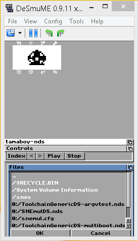

Note: These sources were based originally from (https://github.com/jeffayle/tamaboy)

NTR/TWL SDK: TGDS1.65

tamaboy is a [Tamagotchi v1](http://adb.arcadeitalia.net/?mame=tama) emulator
for Nintendo DS / DSi / 3DS based on [TamaLIB](https://github.com/jcrona/tamalib/).

## Usage

The Tamagotchi's Left, Middle and Right buttons are mapped respectively to the
d-pad Left, UpDown and Right. Or use the touchscreen controls

The same buttons are also mapped to Select, A and B respectively. This mapping
is intended to be as intuitive as possible to navigate the device's menus.

NB: Make sure to set the clock or your egg will never hatch. There should be
animated arrows on the clock screen.

!!!!NOTE!!!!
Saving: Press the Save & Exit button. If you're using hardware, it should turn off automatically. Still, you should be greeted by a message confirming to shut off the NintendoDS.
Reading Save: loading saved tamagotchi can take hours! It WILL load surely. The pet will appear when read process is done.
I'm currently investigating a way to mitigate this issue.
!!!!!!!!!!!!

## Compile Time Dependencies

- TGDS (https://bitbucket.org/Coto88/toolchaingenericds/src)

## How to Compile

Since this is a TGDS project, you can follow the same steps, as, for example, https://bitbucket.org/Coto88/toolchaingenericds-template/

TGDS Port status:

Todo: 
- RTC to allow the tamagotchi to keep time correctly.