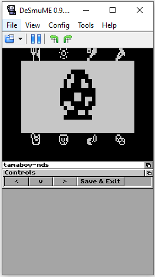

Note: These sources were based originally from (https://github.com/jeffayle/tamaboy)

NTR/TWL SDK: TGDS1.65

tamaboy is a [Tamagotchi v1](http://adb.arcadeitalia.net/?mame=tama) emulator
for Nintendo DS / DSi / 3DS based on [TamaLIB](https://github.com/jcrona/tamalib/).

## Usage

NTR mode: copy arm7dldi-ntr/ndstamaboy.nds and release/drumSample.ima to SD root/base path.
TWL mode: copy arm7dldi-twl/ndstamaboy.srl and release/drumSample.ima to SD root/base path.

The Tamagotchi's Left, Middle and Right buttons are mapped respectively to the
d-pad Left, UpDown and Right. Or use the touchscreen controls

The same buttons are also mapped to Select, A and B respectively. This mapping
is intended to be as intuitive as possible to navigate the device's menus.

NB: Make sure to set the clock or your egg will never hatch. There should be
animated arrows on the clock screen.

!!!!NOTE!!!!
Saving: Press the Save & Exit button. If you're using hardware, it should turn off automatically. Still, you should be greeted by a message confirming to shut off the NintendoDS.
Reading Save: Loading saved tamagotchi happens automatically on boot. Sometimes it can take up to 10~ minutes or even more, please wait... it WILL load! A drumming intro will play when the pet has loaded.
!!!!!!!!!!!!

RTC: Implemented correctly. Reads from internal NDS RTC clock in real time!

## Compile Time Dependencies

- TGDS (https://bitbucket.org/Coto88/toolchaingenericds/src)

## How to Compile

Since this is a TGDS project, you can follow the same steps, as, for example, https://bitbucket.org/Coto88/toolchaingenericds-template/

## 
Drums intro thanks to Thomas Drachmann - A Short Drum Solo

____Remoteboot____
Also, it's recommended to use the remoteboot feature. It allows to send the current TGDS Project over wifi removing the necessity
to take out the SD card repeteadly and thus, causing it to wear out and to break the SD slot of your unit.

Usage:
- Make sure the wifi settings in the NintendoDS are properly set up, so you're already able to connect to internet from it.

- Get a copy of ToolchainGenericDS-multiboot: https://bitbucket.org/Coto88/ToolchainGenericDS-multiboot/get/TGDS1.65.zip
Follow the instructions there and get either the TWL or NTR version. Make sure you update the computer IP address used to build TGDS Projects, 
in the file: toolchaingenericds-multiboot-config.txt of said repository before moving it into SD card.

For example if you're running NTR mode (say, a DS Lite), you'll need ToolchainGenericDS-multiboot.nds, tgds_multiboot_payload_ntr.bin
and toolchaingenericds-multiboot-config.txt (update here, the computer's IP you use to build TGDS Projects) then move all of them to root SD card directory.

- Build the TGDS Project as you'd normally would, and run these commands from the shell.
<make clean>
<make>

- Then if you're on NTR mode:
<remoteboot ntr_mode computer_ip_address>

- Or if you're on TWL mode:
<remoteboot twl_mode computer_ip_address>

- And finally boot ToolchainGenericDS-multiboot, and press (X), wait a few seconds and TGDS Project should boot remotely.
  After that, everytime you want to remoteboot a TGDS Project, repeat the last 2 steps. ;-)

Coto