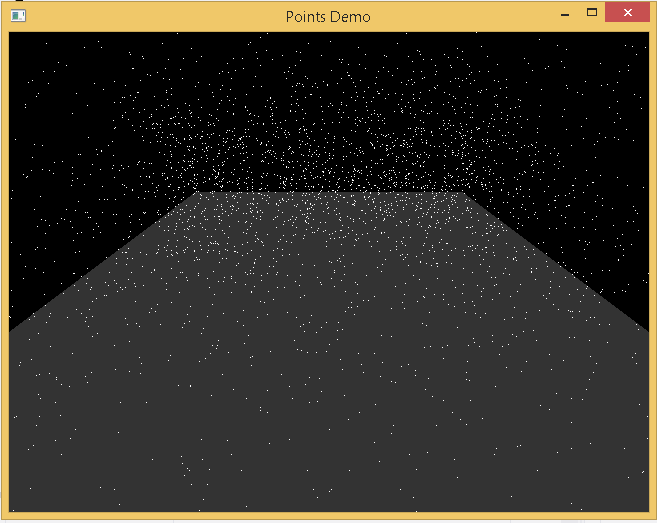
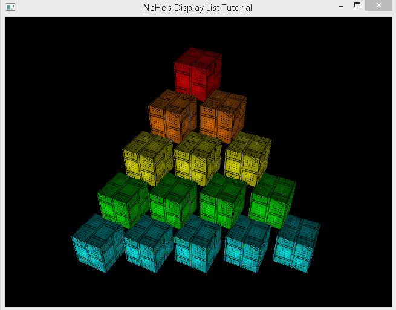

Demo:

C++ Visual Studio 2012 source code of Open GL 1.x points demo using GLUT, FreeGlut: Points Demo

------------------------------------------------------------------------------------

C++ Visual Studio 2012 source code of Open GL 1.x points demo using GLUT, FreeGlut: Open GL Display Lists / OpenGL Call Lists execution (both refer to the same thing)

/

Notes:

Link against static libraries:

Configuration Properties:
->Linker->General:Additional Library Directories
C:\github_clone\openglutvs2012project\glewglut\freeglut\lib
C:\github_clone\openglutvs2012project\glewglut\glew-1.11.0\lib

->Linker->Input: Additional Dependencies
freeglut.lib
glew32.lib

->C++: (Include Directories, header references):
C:\github_clone\openglutvs2012project\glewglut\freeglut\include
C:\github_clone\openglutvs2012project\glewglut\glew-1.11.0\include

